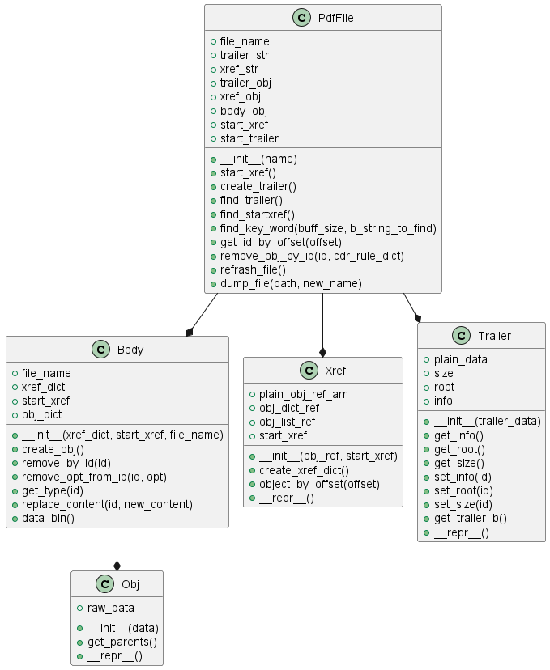

# OpenCDR

<!-- TABLE OF CONTENTS -->

  
Table Of Content

  <ol>
    <li><a href="#cdr-flow">CDR Flow</a></li>
    <li><a href="#file-parsers-structure">File Parsers Structure</a></li>
  </ol>

---------------

<!-- CDR FLOW -->
# CDR Flow
The CDR flow in the code can be described in the following steps:
* **Compile Yara Rules** - compile the YARA rules which corresponds the selected file type as a python object.
Class UML diagrams which describe such objects can be found [here](#file-parsers-structure).
* **Detect Yara Rules Location** - locate the yara rules in the file.
* **Disassemble File** - disassemble the file to a compatible python object by the file's type.
* **Find Detected Objects** - search for the suspected objects in the file with the locations found in **step 2**.
* **Run CDR Rules** - apply changes to the suspected objects in the file according to the CDR rules.
* **Reconstruct File** - write a reconstructed file from the disassembled file object.

-----------------------------

<!-- File Parsers Structure -->
# File Parsers Structure
### PDF Directory UML: 

